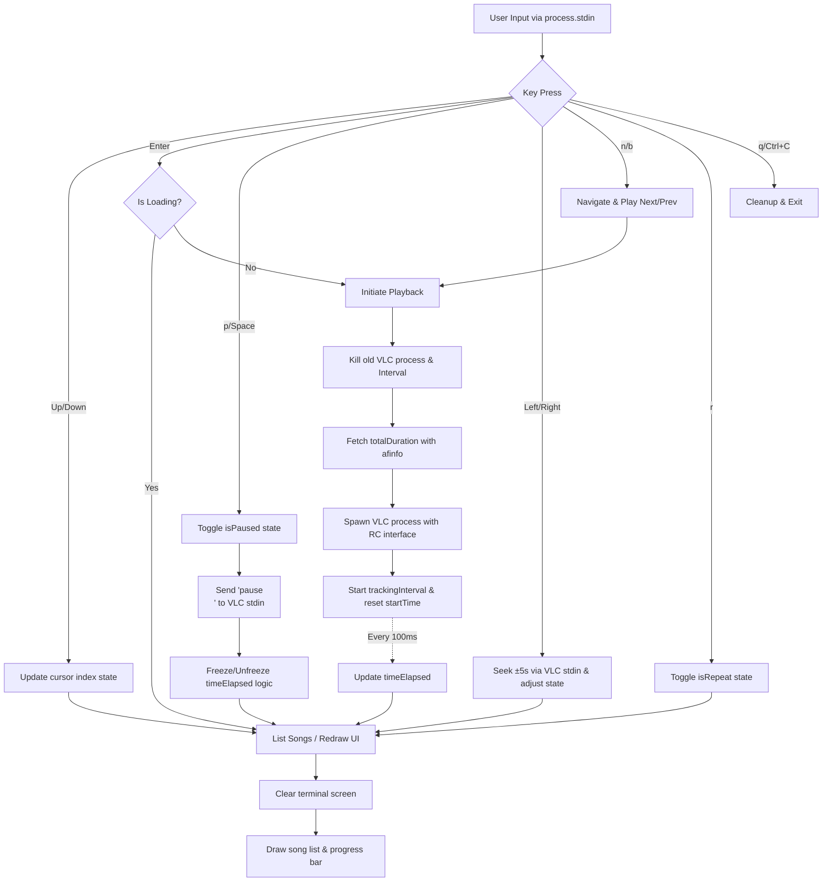

# CLI Music Player Refinement

## Concepts — Terminal Interfaces & Process Management

### What I Learned
Briefly explain the concepts of raw mode input, ANSI escape sequences for terminal control, and managing child processes in Node.js.

### Important Concepts
- `process.stdin.setRawMode(true)`: Capturing individual raw keypresses without needing the user to press Enter.
- ANSI Escape Codes: Special string sequences (e.g. `\x1B[H\x1B[0J`) used to instruct the terminal to move the cursor and clear text.
- `child_process.spawn`: Running external programs asynchronously (`vlc`, `afinfo`).
- Process events: Handling lifecycle events like `close`, `exit`, and `data`.
- Signal trapping: Capturing `SIGINT` (Ctrl+C) to run cleanup code before exiting.

### How It Relates to the Project
These concepts are the foundation of the project. Raw mode and ANSI codes are used to create the interactive, in-place redrawing terminal UI. Child processes are used to delegate the heavy lifting of actual audio playback to VLC in the background.

### Key Takeaway
We can build fully interactive, non-blocking terminal applications in Node.js by combining raw input streams with ANSI control sequences and child process management.

---

## Implementation — Building a CLI Music Player

### Objective
Implement an interactive CLI music player that plays songs from a directory and provides robust playback controls.

### What I Implemented
- Up/Down navigation (clamped at top and bottom to prevent wrapping).
- In-place UI redrawing without ghosting.
- Enter key binding to play the selected song.
- Spacebar/P bindings to pause and resume playback natively.
- Next (`n`) and Previous (`b`) bindings to switch and play adjacent tracks.
- Automatic playlist progression: plays next track automatically on song completion (when repeat is OFF).
- Seek backwards and forwards (`←`/`→`) by 5 seconds in real-time.
- Repeat toggle (`r`) to loop the current track upon completion.
- Modern visual progress bar and elapsed time visualization based on accurate track duration.
- Process cleanup on song exit and application quit.

### Concepts Used
- `fs.readdirSync` for synchronously reading the local `songs` directory.
- `spawn('vlc')` with the Remote Control (`rc`) interface for interactive playback.
- `spawn('afinfo')` for retrieving metadata.
- `setInterval` for tracking elapsed playback time and syncing the UI.

### Project Connection
This phase resulted in the final `lecture_5.js` code which acts as our fully featured CLI music player, integrating all the individual system and terminal manipulation concepts.

### Key Takeaway
Managing state properly (coordinating variables like `isPaused`, `totalDuration`, and `trackingInterval`) is critical to ensuring the visual UI stays synchronized with an external asynchronous background audio process.

---

## Questionnaire

1. **The first arrow-navigation version printed the song list again and again. Why did that happen, and how did you make the list redraw in the same place?**
   It happened because each UI update used standard `process.stdout.write()` which appends new lines to the terminal buffer natively, pushing old text up. To redraw in-place, we used ANSI escape sequences `\x1B[H` (which moves the cursor to the top-left) and `\x1B[0J` (which clears everything from the cursor to the end of the screen) before printing the updated list frame.

2. **Why do we need both cursor movement and line clearing while redrawing the terminal UI? What problem can happen if you only move the cursor?**
   If you only move the cursor back up to the top and overwrite the existing text, shorter lines in the new frame will leave behind dangling characters from the previous, longer lines (this is known as ghosting). Line clearing ensures the area is totally blank before drawing the new frame.

3. **What does the selected-song variable represent? How do you make sure the user cannot move above the first song or below the last song?**
   The `cursor` variable stores the integer index of the currently selected song in the `allSongs` array. We ensure the user cannot move above the first or below the last song by logically bounding the arithmetic. For the up arrow, we use `if (cursor > 0) cursor--;`, and for the down arrow, we use `if (cursor < allSongs.length - 1) cursor++;`.

4. **Why was afplay + SIGSTOP/SIGCONT not a reliable solution for a real pause/resume feature? What changed in the final approach?**
   *(Based on the standard macOS afplay tool)* `afplay` does not have an internal interface to pause smoothly or report its exact playback position, and using OS signals like `SIGSTOP` just freezes the entire OS process abruptly, making accurate position tracking in our Node.js app nearly impossible. The final approach uses `vlc` with the Remote Control (`rc`) interface (`-I rc`), which allows us to send the exact string `pause\n` directly to VLC's standard input for a clean, application-level pause.

5. **How would you prove that the pause/resume implementation is correct? Describe a small test you would perform.**
   Start playing a 12-second song. Wait exactly 4 seconds, and press Space to pause. Wait 5 seconds in real-time, then press Space to resume. The song audio should resume exactly from the 4-second mark, and finish naturally 8 seconds later (at the 12-second mark). The visual progress bar should not increment at all during the 5 paused seconds.

6. **How is the progress percentage calculated? What should happen to the progress value while the song is paused?**
   It is calculated conceptually as `(timeElapsed / totalDuration) * 100`. The `totalDuration` is fetched once at the start via `afinfo`. The `timeElapsed` is manually tracked by comparing `Date.now()` with our stored `startTime`, minus any accumulated `totalPausedTime`. While the song is paused, the `timeElapsed` calculation is frozen by tracking the `pausedAt` timestamp, so the progress value stays perfectly still.

7. **When the user starts a new song while another song is already playing, what needs to be stopped or cleaned up? What could happen if you do not do this?**
   The previous VLC `spawn` process (`vlcPlayProcess`) needs to be killed (e.g. via `kill('SIGKILL')`), its event listeners (like `close`) must be removed, and the UI `trackingInterval` must be cleared immediately. Because fetching duration is asynchronous, we also set an `isLoadingSong` lock to ignore rapid keypresses. If this is not done, multiple VLC processes will run and play audio overlapping each other, and multiple UI intervals will fight to redraw the screen, causing intense flickering and resource leaks.

8. **Describe one bug or unexpected behaviour you faced while refining this application. What did you initially think was wrong, how did you investigate it, and what was the actual fix?**
   When a song finished playing naturally, the terminal UI continued to redraw itself rapidly in the background. I initially thought the VLC process hadn't closed properly. Upon investigating the `cp.on('close')` event, I realized the event was firing correctly, but the `trackingInterval` (the `setInterval` for updating the time) was never being explicitly cleared when the song ended. The fix was adding `clearInterval(trackingInterval)` inside the close event handler.

9. **If you had to add "jump forward 10 seconds" next, which part of the current application would change and what existing playback information would you reuse?**
   We would capture a new keypress (e.g. right arrow). We would reuse the `vlc` rc interface by writing the command `seek +10\n` to `vlcPlayProcess.stdin`. We would then also need to manually adjust our JS state: adjusting `startTime` (by subtracting 10,000 milliseconds) so our custom JS progress tracker stays perfectly in sync with the new VLC playback position.

---

## Architecture Documentation

### Flow Overview
The application handles asynchronous terminal input, updates internal JS state, orchestrates VLC playback, tracks time, and continuously renders a unified UI frame to standard output.

